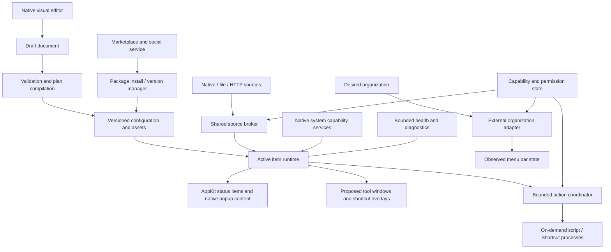

# MenuSprite native architecture

Working proposal · 7 September 2026 · No implementation exists

**8 September priority:** this is broader reference architecture. Follow
[First personal build](../first-personal-build.md) for current work. Marketplace,
social and public extension-package machinery are deferred; their unresolved
contracts do not block the personal native app. Reuse only the portions needed
by the selected daily tools and measured resource requirements.

**Scope revision:** [Sprite platform direction](sprite-platform.md) supersedes
the menu-bar-only runtime assumption. This document now sketches the expanded
host/package/community boundaries. Surface, native extension, sustained-service
and marketplace contracts are not yet development-ready specifications.

This describes a coherent starting architecture for the proposed feature set.
D-02, D-04, D-06–D-09, and D-12 remain consequential decisions. Public API evidence
and investigations are recorded in [feasibility.md](feasibility.md). API references
are evidence for capabilities, not proof of this application's behavior.

## 1. Technology and process structure

Propose **Swift with AppKit status-item ownership and SwiftUI editor/popover
content**. AppKit gives explicit ownership of dynamic status items, their buttons,
menus, identities, and lifecycle. SwiftUI is appropriate for native editing and
composable controls. Prototype rendering/interaction details when development is
authorized. This choice does not imply SwiftUI cannot implement menu bar apps;
Apple provides [MenuBarExtra](https://developer.apple.com/documentation/swiftui/menubarextra).
The explicit AppKit layer is a design recommendation for this product's dynamic
item and layout requirements. [NSStatusItem documentation](https://developer.apple.com/documentation/appkit/nsstatusitem)

Propose one native host target with logical modules in `native/`, keeping `site/`
separate. Versioned sprite packages now provide a concrete extension boundary;
specify it before choosing a plugin framework/ABI. A separate online service is
needed for the intended marketplace/social capabilities. Hosting, backend stack,
storage and identity are undecided. No embedded browser or bundled scripting
runtime is chosen by this document.

The host remains alive with its editor closed. Work belongs to enabled sprites:
finite scripts, long operations and sustained services have different lifecycle
contracts. Installed-but-disabled packages must not create resident processes.
Native helper/XPC/isolation design follows capability and trust investigations;
no privileged helper is assumed merely because broader system tools are desired.

## 2. Logical responsibilities

| Component | Owns | Must not own |
| --- | --- | --- |
| App lifecycle | Launch/reopen, editor window, login registration, sleep/wake, recovery entry | Source-specific sampling logic |
| Document store | Validated revisions, drafts, migration, import/export, assets | Mutable live measurements or executable side effects |
| Visual editor | Block/presentation editing, undo, sample/live preview | A second proprietary behavior format or runtime timers |
| Validator/compiler | Type checking, capability/dependency checks, graph validation, immutable execution plan | Running arbitrary user scripts while validating |
| Source broker | Reference-counted providers, sharing keys, caching, sampling demand | Per-item layout or side-effect action policy |
| Scheduler | Coalesced deadlines, demand changes, backoff, sleep/wake reconciliation | One persistent timer per block or item |
| Item runtime | Evaluate pure bindings/conditions; item-local state and transitions | AppKit calls off main actor; blocking I/O |
| Renderer | NSStatusItem lifecycle, diffed appearance, menus/popovers, accessibility | Starting a new source when a view is recreated |
| Action coordinator | Per-item ordering, explicit runs, consent state, cancellation, results | Automatic retry of uncertain external effects |
| Execution supervisor | Finite jobs, long operations, sustained services; input/output, per-class limits, cleanup | Treating subprocess isolation as a security boundary |
| Surface coordinator | Proposed tool windows, shortcut overlays, popup/bar surfaces sharing sprite state | Requiring a permanent status item merely to keep enabled behavior active |
| Native capability services | Supported app/window/workspace/input and other OS operations; lifecycle and restoration | Calling unbounded user code synchronously inside input callbacks |
| Package manager | Versioned packages, compatible capabilities, local instances/overrides, install/update/remove | Overwriting user edits or assuming package metadata enforces a sandbox |
| Community client | Explicit discovery/publishing/social operations | Making installed local sprites depend on a live marketplace session |
| Organization adapter | Discovery, capability report, requested changes, observed reconciliation | Mutating another app's data or pretending its item is owned |
| Capability/permission service | Feature availability and observed OS authorization | Persisting authorization as if the app can grant it |
| Diagnostics | Bounded durations, counts, errors and redacted activity | Full indefinite logs, secret capture, expensive continuous profiling |

Use structured concurrency and explicit ownership. Main actor owns AppKit and
presented UI state. A serialized runtime/store coordinator applies revisions;
source tasks perform I/O off the main actor and deliver immutable snapshots.
Providers do not call each other synchronously. Cancel subscriptions/tasks when
their last consumer leaves; release views, observers, processes, and buffers.

## 3. Canonical model

Persist a versioned, declarative document, not generated Swift or UI view trees.
The same representation supports the editor, runtime, templates, and export.
These are conceptual contracts; an actual schema is to be created after the
open product decisions are resolved.

| Entity | Required information / invariant |
| --- | --- |
| Workspace | Schema version, workspace ID, revision, active profile ID, items, sources, profiles, asset references, preferences |
| SpriteDefinition | Replaces the old ItemDefinition concept: stable ID, name, required identity icon reference, surface declarations, source bindings, block graph, variables, behavior, settings and lifecycle policies |
| SpritePackage | Publisher/package identity, version, compatible host/capability versions, declarative content/assets/code, dependencies and declared access; exact manifest open |
| SpriteInstance | Local ID, package/version reference or local definition, personal configuration, theme/layout/behavior overrides; enabled and showInMenuBar are independent states; separate from upstream code |
| SurfaceDefinition | Menu bar face is optional (confirmed D-17); menu/popover, tool window and overlay details remain proposed. Identity icon exists independently of a rendered bar surface. |
| Presentation | Ordered text/image/value/chart elements; typed bindings; font/color/width/alignment; state styles; accessible label; optional bounded animation |
| ExpandedMenuBoardDefinition | Optional part of SpriteDefinition: custom UI layout, stable element/control IDs, data bindings, named actions, styles and local input state. Opened by its icon click when configured. Native rendering mechanism and exact layout vocabulary remain proposed. |
| SourceDefinition | Stable ID, provider ID/version, nonsecret config, secret/bookmark references, output type, requested refresh policy |
| BlockGraph | Stable block IDs, kinds/versions, inputs, typed connections, branches, event-stack order, layout metadata |
| VariableDefinition | ID, type, default, persistence choice; runtime value is separate from its declaration |
| Profile | Stable ID/name, ordered item references, enabled membership, owned grouping, desired external organization rules |
| ExternalItemReference | Best available owner/item identifiers, disambiguation information, user-assigned alias, confidence; never a screenshot or session PID alone |
| LayoutObservation | Current items/positions, display/session context, available operations, observation time; transient, distinct from requested policy |
| Asset | Content-derived identifier, relative bundle path, type, decoded bounds, optional animation metadata |
| DataSample | Source ID, value/type/unit, observation timestamp, collection timestamp, sequence, availability, error context; no fake numeric sentinels |
| ActionRun | Run ID, item/revision/trigger ID, immutable input, start/end, state, bounded/redacted output and outcome certainty |
| CapabilityState | Feature/provider, supported/unsupported/unknown, permission not-requested/granted/denied/revoked as observable, reason, possible recovery |

Value types: text, bool, integer/decimal, date/time, duration, enum, color, image
reference, bounded list, structured record, and explicit absence. Numeric units
belong to type metadata. Arithmetic/comparisons reject incompatible units unless
an explicit conversion is supplied. Source schema changes invalidate affected
bindings visibly. Missing data is not coerced to empty/zero/false automatically.

Two time fields distinguish when a reading was observed from when it arrived.
Freshness is evaluated per consumer against a declared `staleAfter` policy;
different items can require different freshness from the same cached sample.
Runtime uses monotonic time for durations and wall time for human timestamps and
calendar schedules. Persistent timestamps are sufficient to reconcile countdowns
after sleep; no timer needs to run while the computer sleeps.

## 4. Provider and action contracts

A provider describes its configuration fields, output schema, required
capabilities, available update modes, minimum recommended interval, and cost
class. It supports start/subscription, sample when applicable, demand update,
and stop/cancel. Outputs are immutable DataSamples or explicit availability
changes. Native providers never launch CLI commands merely to collect a reading.

The source sharing key includes provider/version, normalized configuration,
credential identity, and relevant access context. Resolve the fastest demand
among enabled consumers within the provider's effective limits. A hidden item's
notification rule may still require data; a hidden popup-only chart does not.
Do not stop a necessary subscription just because its face is not currently drawn.

Actions describe input schema, required access, whether they have external side
effects, supported cancellation, and the meaning of success. Result states are
queued, running, succeeded, failed, cancelled, timed-out, or outcome-unknown.
Cancellation does not reverse external work. Scripts/Shortcuts that may change
files or services are never automatically replayed after crash or wake.

### Candidate provider: external app data

Parked as low priority by Prerak (D-21). The retained notes below are not a current
architecture dependency; do not build out this provider while planning the core.

DATA-15 would adapt an explicitly selected app/interface or Accessibility element
into the existing DataSample contract, using permitted attributes and supported
notifications or bounded polling. Capture/OCR would be a separately enabled
fallback with method/confidence/provenance, not an assumed transparent substitute
for structured data. Source app version, owner/element identity and parser belong
to the adapter configuration; reacquire after restart without guessing matches.

Keep this separate from the organization adapter: permission to move/hide an
item does not prove its readings remain available. Likewise, a data reader does
not imply a write/action interface. Source-app lifecycle and hidden/closed-menu
behavior are capability results, with unavailable/stale samples when needed.
Use cooperative APIs or external observation; injecting into arbitrary target
processes is not an established or recommended baseline. See V-10 and the
dedicated assessment in [feasibility.md](feasibility.md).

## 5. Evaluation and scheduling

Applying a valid draft creates an immutable execution plan. Pure data dependencies
are a DAG. Evaluate affected bindings only when inputs change; evaluate ordered
event stacks for matching events. Per item, process trigger events in deterministic
order and coalesce replaceable source-change events. Click events are not silently
coalesced into repeated external actions. Expose a busy state while an action
configured as non-reentrant is running.

Store the previous condition state for transition rules. Hysteresis, sustained
duration, and cooldown prevent repeated notifications and oscillation. Condition
evaluation never implicitly grants access or launches a missing dependency.

One deadline queue owns scheduled provider refreshes and calendar boundaries.
Use OS notifications for changes when available; coalesce/tolerate noncritical
timers. Apple documents the energy cost of excessive timer wakeups and recommends
events and timer tolerance. [Apple energy guidance](https://developer.apple.com/library/archive/documentation/Performance/Conceptual/power_efficiency_guidelines_osx/Timers.html)

On wake, refresh active sources once as needed, recompute wall-clock displays,
and reconcile elapsed timers. Do not replay every missed interval or side effect.
On lock/sleep, stop animation and suspend discretionary polling. Preserve events
required by explicitly enabled behavior only where the OS permits them. On Low
Power Mode/thermal pressure, use the agreed reduced-work policy and show any
effective schedule change; do not claim realtime guarantees.

Defaults below are **proposed limits for the original finite/local workloads**,
adjustable after benchmarks and D-12. They are not universal deadlines for Homebrew
operations or sustained services. Those need per-class cancellation, progress,
restart/backoff and budget contracts before implementation.

| Work | Proposed policy |
| --- | --- |
| Local polling | 5 s typical for CPU/memory/network rates; 1 s minimum ordinary interval; 60 s storage |
| Remote reads | 60 s default, 5 s minimum ordinary interval; 10 s request timeout, at most 4 concurrent requests globally |
| Finite script data runs | Manual/60 s default, 10 s wall deadline, 2 process jobs globally, 1 scheduled run per source |
| Script actions / Shortcuts | Explicit trigger; 30 s default deadline, configurable for known interactive tasks; interaction-required state instead of repeated relaunch |
| Failed polling | Exponential backoff from requested interval capped at 15 min; respect applicable server retry guidance; explicit Refresh can retry |
| Repeated script failures | Pause after 3 consecutive failed automatic runs, with explicit Resume |
| Script output / HTTP body | 256 KiB combined captured script output; 1 MiB HTTP body; stop reading/cancel and report limit |
| Histories / log tails | 300 samples per plotted series; 500 recent log lines and 1 MiB per active tail, whichever bound is reached first |
| Animation | 12 fps upper starting target, one-shot preferred; aggregate budget measured; no always-running display link for static items |

Scheduled work that is already running gets at most one pending refresh; never
an unbounded queue. Stale results from a cancelled or replaced revision cannot
overwrite the new revision. Runtime memory, image cache, and active-provider
counts need global caps as well as per-source limits; calibrate their proposed
initial limits in V-04 before accepting large imported workspaces.

## 6. Rendering and placement

Create owned status items with stable autosave identities where supported. Render
through the status-item button and supported native content; avoid deprecated
custom status-item view APIs. Re-render only when the output changes. Keep chart
and image caches bounded. Validate colored attributed text, user fonts, symbols,
alignment, accessibility, and animation against the actual target OS.

Independent status items permit native placement but exact order and position
are subject to macOS. A combined owned group can guarantee internal order while
trading away interleaving with third-party items. Neither approach proves control
of the whole bar or arbitrary independent layouts on each display.

`isVisible` is not proof that pixels are unobscured by a notch/overflow/auto-hide.
Where real visibility cannot be detected reliably, use explicit enablement,
popup lifecycle, session/display state, and conservative animation behavior.

The organizer reports operations individually: discover, identify, move, hide,
reveal, activate, and capture preview. Each reports supported, unavailable due to
permission/state, or unsupported. The editor offers only meaningful operations.
Follow external changes rather than continually fighting the OS/user's placement.
Bound retry/reconciliation attempts and keep an emergency disable/reveal route.

Applying owned configuration is transactional. External arrangement is a sequence
of observable operations, not an atomic transaction with other apps. Capture a
prior observation, execute bounded steps, verify each, and report partial success;
best-effort undo must not be described as guaranteed rollback.

## 7. Persistence, import, and recovery

Propose versioned JSON documents in Application Support plus a content-addressed
asset directory. Preferences small enough for app settings can use UserDefaults;
credentials use Keychain references. Avoid a database until query/scale needs
justify one. Keep source histories and diagnostic tails in bounded memory by
default; user-selected persistent variables live in a separate small state file.

Serialize writes through one owner; atomic replace and last-good backup. Draft
and active documents are separate. Migrations operate on a copy, validate, then
promote; failed migration leaves the original recoverable. Never overwrite a
newer unsupported schema. Closing the editor releases its UI while retaining only
the documents and active runtime state needed for operation.

Export a proposed `.menusprite` bundle containing manifest, selected definitions,
dependency closure, and assets. No credentials, permission claims, live logs, or
external file contents by default. Import validates version, total expanded size,
asset decoding limits, paths and references; rejects traversal/symlink escapes.
Import assigns/remaps IDs for a copy, resolves conflicts explicitly for replacement,
and requires local file/credential rebinding. Imported executable integrations
remain disabled until reviewed and enabled.

After repeated failed starts, offer recovery with scripts, automatic actions,
animation, and external organization disabled. Static owned items and the editor
must remain usable. Keep the previous active revision until the new one validates.
Never claim that configuration recovery reverses a command's external effects.

## 8. Permissions and trust

Map access to individual features: selected file access, network integration,
notifications, login registration, Accessibility for applicable organization,
screen capture only if a selected technique needs it, and Automation only for
chosen integrations. Verify actual requirements with the distribution/signing
configuration. Screen capture and unrestricted logs are not baseline privileges.

The proposal favors direct distribution because arbitrary user-selected commands
and advanced organization need investigation before committing to an App Store
model. Sandboxing, entitlements, signing, and script process access are decisions
for V-06, not assumed solved. Native built-ins remain usable without scripts or
external organization permissions.

Run processes with an explicit executable, argument array, controlled environment,
and structured stdin where needed. Keep secrets out of arguments/logs when
possible. Bound output and lifetime; terminate owned jobs and supported process
groups on cancellation. A detached descendant may escape ordinary process-group
cleanup: treat scripts as trusted user code and test/document this limit. A
subprocess provides responsiveness/failure separation, not a sandbox or a hard
instantaneous CPU/RAM limit. Shortcuts can also have external effects and prompts.

## 9. Alternatives and development handoff

| Alternative | Why not the current recommendation / revisit condition |
| --- | --- |
| SwiftUI MenuBarExtra alone | Valid platform capability; evaluate if it meets dynamic item identity, styling, and lifecycle requirements with less code. AppKit is proposed for explicit control, not claimed uniquely possible. |
| Separate always-running editor process | Could lower resident runtime cost but adds IPC, packaging, and state complexity. Measure editor teardown first; split only for demonstrated budget failure. |
| One helper per data source | Excess processes and memory for a small utility. Shared native providers and a bounded job runner first. |
| Generate Swift/shell from visual blocks | Makes round-trip editing, safety, and dependency tracking harder. Interpret the declarative model. |
| Embed browser/Node for builder | Conflicts with the preferred native footprint; no present requirement justifies it. |
| Native plugin ABI | Versioned sprite installation and marketplace are now required direction. Choose whether/how downloadable native code is supported after defining capability, isolation and compatibility contracts; do not equate marketplace support with arbitrary in-process binaries. |
| Automatic iCloud document sync | Requires merge, secret, file-reference, and multi-device decisions. Portable export/import is the initial proposal. |

## 10. Expanded contracts still to specify

Separate **appearance customization** from **behavior customization** and from
**adding a new native capability**. The builder should expose host primitives for
system integrations; packages compose them and add scripts/code where supported.
Surface layout, typography, colors, shortcuts and exposed actions must be editable
for installed sprites too. Native custom components must declare their editable
properties; a fixed opaque plugin UI would recreate the problem Prerak described.

The package lifecycle needs dependency resolution/version pinning, compatible
host APIs, publisher identity and artifact integrity, installation review,
activation, user overrides, upgrades/migrations, rollback, disable/uninstall and
orphaned dependency cleanup. Removal must restore temporary OS/input changes
where supported and disclose nonreversible external effects. Do not erase user's
settings just because a package is removed unless that is their chosen action.

Execution classes proposed: on-demand finite job; scheduled finite collection;
enabled event-driven service; long user-initiated operation. Each reports health,
ownership, access and cost. Native input services need bounded callbacks and a
fail-open disable path; scripts run outside those callbacks. Exact quotas,
isolation and allowed native extension mechanisms are open investigations.

Online domain objects proposed: creator identity, package listing, version/artifact,
publication state, like and friend relationship. Define browsing/account rules,
friend semantics, privacy, moderation/reporting, distribution integrity and
operation costs before selecting a backend. Feeds, chat, payment and subscriptions
are not implied by the mention of friends/marketplace. Local runtime must not be
coupled to the social database.

These are necessary architecture questions, not finished schemas or an instruction
to build services now. The original local runtime detail above remains useful
within its scope; it no longer constitutes the whole product architecture.

When development is authorized, resolve the native investigations and accepted
decisions, then create the native target. Do not scaffold speculative services or
frameworks now. Proposed module names are responsibilities, not a requirement to
create one file/class/package for every row in this document.
